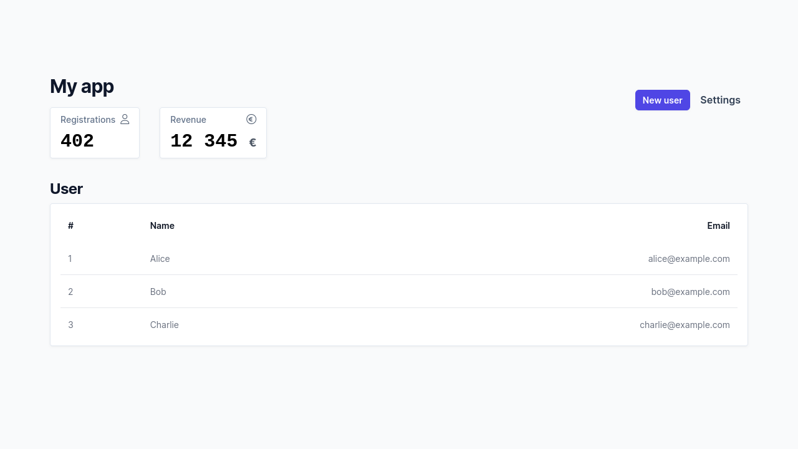
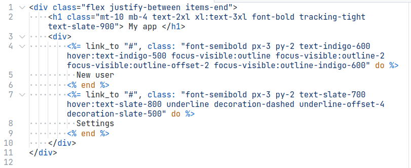
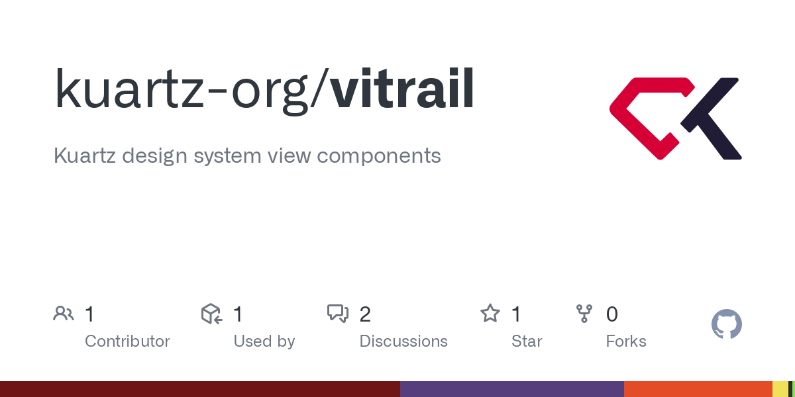
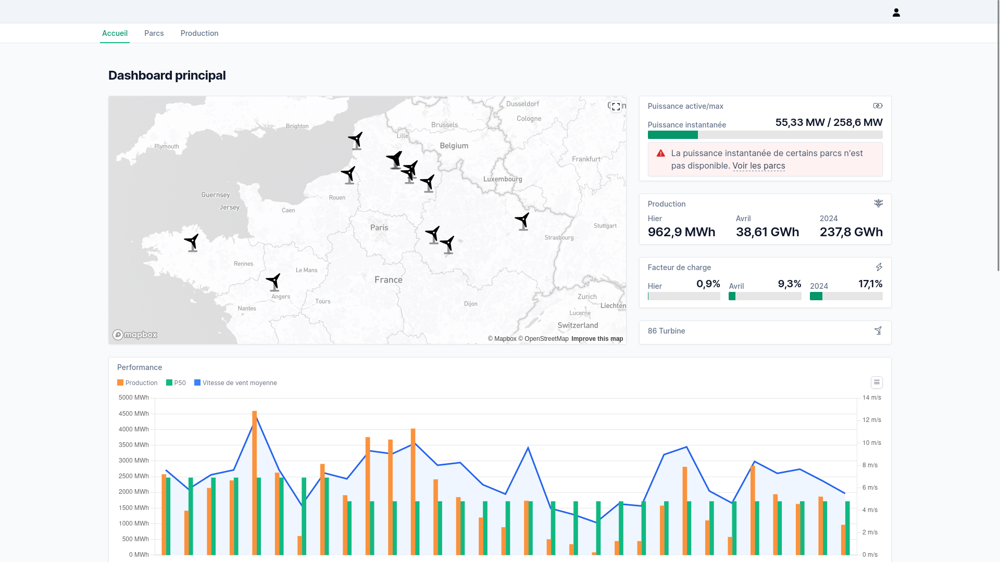

> “Where is the HTML?”

— A front-end developer


# Douleurs 🤕

<ul style="list-style-type: none">
  <li class="fragment">❌ Hétérogénéité dans nos applications</li>
  <li class="fragment">❌ Sensations de réinventer la roue à chaque fois</li>
  <li class="fragment">❌ Besoins de compétences en UI</li>
</ul>


<!-- .element: height="250" -->

<ul style="list-style-type: none; font-size: 2.25rem">
  <li class="fragment" style="margin-bottom: 1.5rem;">🎨 <strong>Design System :</strong> ensemble de règles et de composants réutilisables</li>
  <li class="fragment" style="margin-bottom: 1.5rem;">🔧 <strong>Component Library :</strong> implémentation technique du Design System</li>
  <li class="fragment" style="margin-bottom: 1.5rem;">✨ <strong>Vitrail :</strong> Gem du Design System sur ViewComponent</li>
</ul>


## ✨ Avantages ✨

<ul style="list-style-type: none">
  <li class="fragment">✅ Uniformisation</li>
  <li class="fragment">✅ Réutilisation (DRY)</li>
  <li class="fragment">✅ Facilité d'utilisation</li>
</ul>


## Exemple

<!-- .element: height="400" -->


### Header
good ol' ERB with Tailwind CSS

<!-- .element: height="400" -->


### Header
_with Vitrail™_

```erb[2,4-5]
<div class="flex justify-between items-end">
  <%= vt_title { "My app" } %>
  <div>
    <%= vt_link_to(:primary, "#") { "New user" } %>
    <%= vt_link_to(:secondary, "#") { "Settings" } %>
  </div>
</div>
```


KPIs

```erb[3-5,7-9]
<div class="flex space-x-8">

  <%= vt_kpi(title: "Registrations", icon: "user") do %>
    <%= @registration_count %>
  <% end %>

  <%= vt_kpi(title: "Revenue", icon: "circle-euro) do %>
    <%= @revenue %>
  <% end %>

</div>
```


Table

```erb[1,14|3-5|8-12]
<%= vt_table(id: "users") do |table| %>

  <%= table.with_header.with_content("#") %>
  <%= table.with_header.with_content("Name") %>
  <%= table.with_header.with_content("Email") %>

  <% @users.each do |user| %>
    <% table.with_row do |row| %>
      <%= row.with_division.with_content(user.id) %>
      <%= row.with_division.with_content(user.name) %>
      <%= row.with_division.with_content(user.email) %>
    <% end %>
  <% end %>
<% end %>
```


What's inside? 👨‍💻

<!-- .element: height="400" -->

[github.com/kuartz-org/vitrail](https://github.com/kuartz-org/vitrail)


Real world


